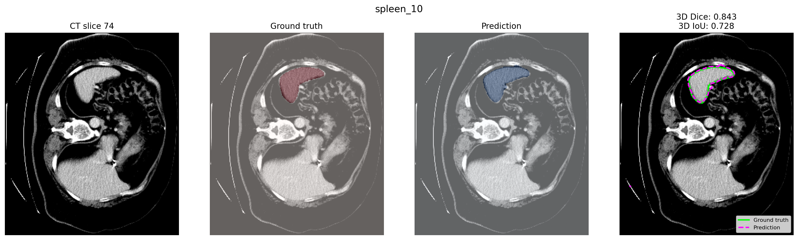
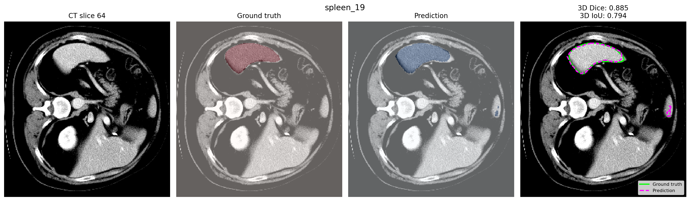
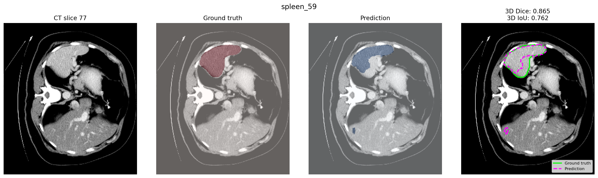

# 3D Spleen Segmentation from CT Scans

An end-to-end 3D medical image segmentation pipeline developed with PyTorch and MONAI for volumetric spleen delineation from abdominal CT scans.

The pipeline includes voxel-spacing normalization, CT intensity windowing, 3D patch-based training, spatial augmentation, Dice–cross-entropy optimization, and sliding-window inference.

## Results

| Metric | Result |
|---|---:|
| Mean held-out test 3D Dice | **0.8083** |
| Mean held-out test 3D IoU | **0.6984** |

Dice and IoU were calculated over the complete 3D prediction and ground-truth volumes.

## Sample Segmentations

The figures show representative 2D axial slices from held-out 3D CT volumes. The reported metrics were calculated over the full 3D volumes.

### Sample Result 1



### Sample Result 2



### Sample Result 3



Ground-truth boundaries are shown in green, while predicted boundaries are shown with dashed magenta contours.

## Method

The segmentation pipeline consists of:

1. Loading CT images and segmentation masks in NIfTI format
2. Converting volumes to a consistent RAS orientation
3. Resampling scans to a common voxel spacing
4. Applying CT intensity windowing and normalization
5. Cropping foreground regions
6. Sampling foreground- and background-centered 3D patches
7. Training a 3D U-Net from random initialization
8. Performing full-volume sliding-window inference
9. Evaluating predictions using 3D Dice, IoU, precision, and recall

## Model

The model is a 3D U-Net with:

- One CT input channel
- Two output classes: background and spleen
- Instance normalization
- Residual convolutional units
- Dropout regularization
- Approximately 4.8 million trainable parameters
- 
## Dataset

This project uses the `Task09_Spleen` dataset from the Medical Segmentation Decathlon.

Download the dataset and arrange it as:

```text
Task09_Spleen/
├── imagesTr/
├── labelsTr/
├── imagesTs/
└── dataset.json
```
The CT volumes and annotations are not included in this repository.

## Repository Structure

```text
3D-Spleen-Segmentation-from-CT-Scans/
├── configs/
│   └── train.yaml
├── results/
│   ├── sample_results_1.png
│   ├── sample_results_2.png
│   ├── sample_results_3.png
│   ├── training_loss.png
│   └── validation_dice.png
├── scripts/
│   ├── inspect_data.py
│   ├── check_pipeline.py
│   ├── train.py
│   ├── evaluate.py
│   └── plot_test_samples.py
├── src/
│   └── spleen3d/
│       ├── __init__.py
│       ├── data.py
│       ├── loaders.py
│       ├── metrics.py
│       ├── model.py
│       └── transforms.py
├── .gitignore
├── pyproject.toml
├── requirements.txt
└── README.md
```

## Running the Project

Install the required packages:

```bash
pip install -r requirements.txt
pip install -e .
```

Update the dataset and output paths in `configs/train.yaml`:

```yaml
data:
  root_dir: "/path/to/Task09_Spleen"
  cache_dir: "/path/to/cache"

output:
  directory: "/path/to/outputs/full_training"
```

Train the model:

```bash
python scripts/train.py --config configs/train.yaml
```

Evaluate the best checkpoint:

```bash
python scripts/evaluate.py \
  --config configs/train.yaml \
  --checkpoint outputs/full_training/best_model.pt
```


Generate segmentation figures for the held-out test cases:

```bash
python scripts/plot_test_samples.py \
  --config configs/train.yaml \
  --checkpoint outputs/full_training/best_model.pt
```


## Author

**Sudipta Paul**  
Ph.D. Candidate, Rensselaer Polytechnic Institute

Email: pauls5@rpi.edu
